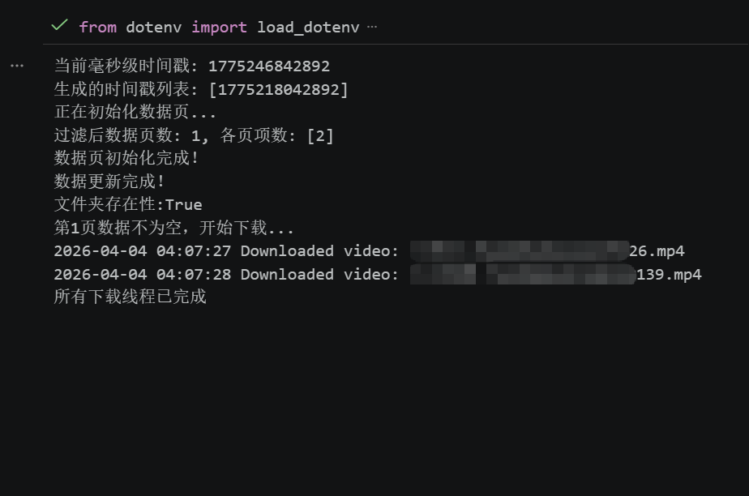
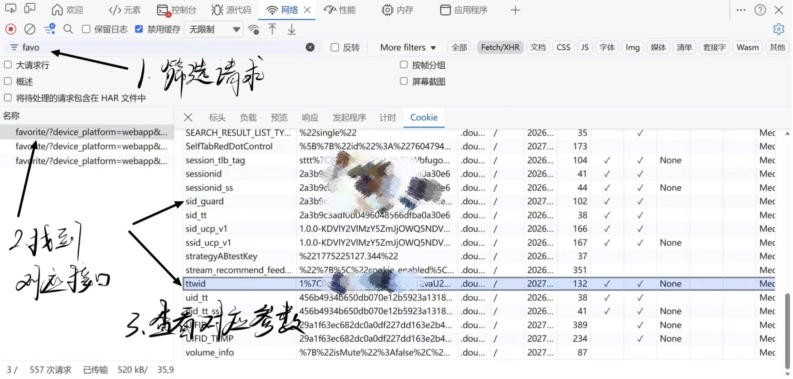
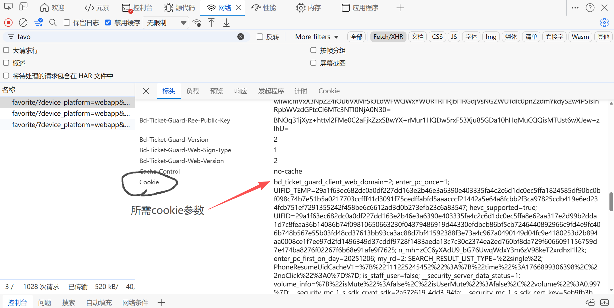

# dy-spider
 一个用于爬取自己抖音喜欢列表的小程序
 > 整个过程不算慢，支持多线程下载，自定义存储地址 

## 🛠️ 环境安装

在运行程序之前，请确保你的电脑已安装 **Python 3.7+**。

1. **克隆仓库或下载代码**
   ```bash
   git clone https://github.com/Vespera-Su/dy-spider.git
   cd dy-spider
2. **激活虚拟环境**
* Windows:
   ```bash
   .\venv\Scripts\activate
* macOS/Linux:
   ```bash
   source venv/bin/activate

3. **安装依赖项**
   ```bash
   pip install -r requirements.txt

## ttwid，sid_guard，cookie参数获取
1. 需要先登录[抖音网页版](https://www.douyin.com)
2. 按F12进入开发者模式-网络
3. 筛选请求，前缀一般含favorite
4. **获取ttwid，sid_guard**
5. **获取cookie**
6. 将对应的值复制到根目录下config.json对应键值

## config.json
---
|**字段**|**类型**|**必填**|**默认值**|**说明**|
|---|---|---|---|---|
|**cookies**|Object|是|-|包含 `ttwid` `sid_guard` 和 `cookie`，用于身份验证，请从网页端获取。|
|**save_path**|String|否|`null`|文件的本地存储路径（例如：`D:/downloads` 或 `./data`）。|
|**start_timestamp**|Integer|否|`null`|数据采集的起始时间戳（单位：毫秒级）。若为 `null` 则从当前时间开始。|
|**step_hours**|Integer|否|`1`|每次请求的时间跨度步长（单位：小时）。|
|**count_page**|Integer|否|`1`|总共采取的步数。|
|**redownload**|Boolean|否|`false`|是否开启重新下载模式。`true` 会覆盖已存在的同名文件。|
> **！**若**save_path**为`null`会在项目根目录新建`downloads`文件夹

## 启动命令
`python main.py`